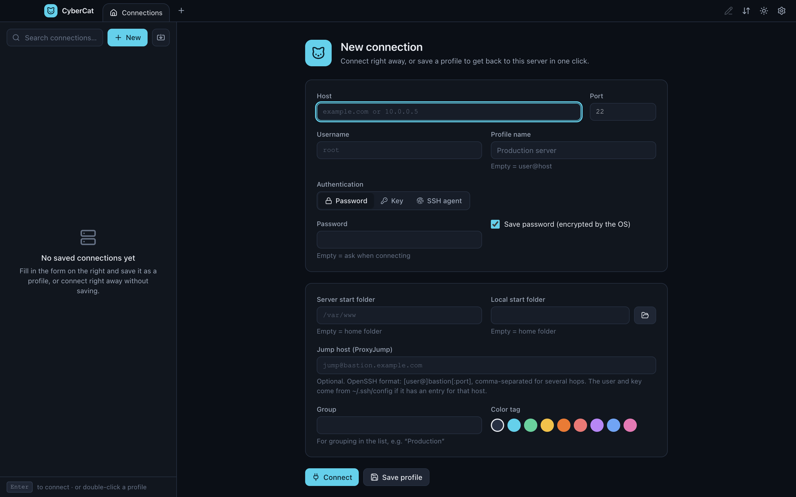
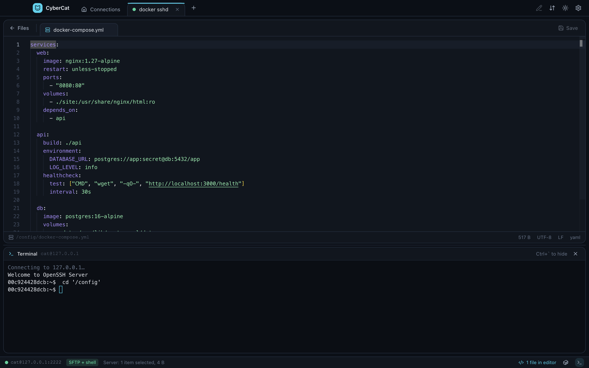
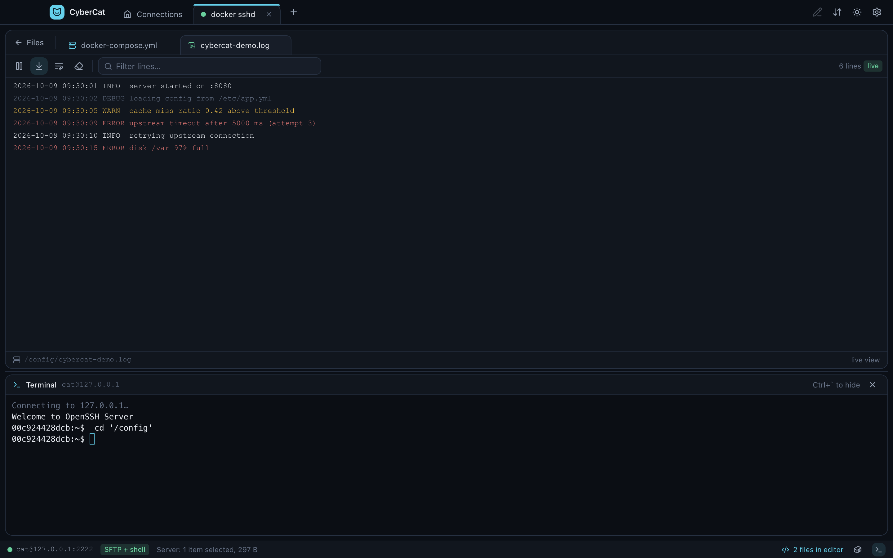
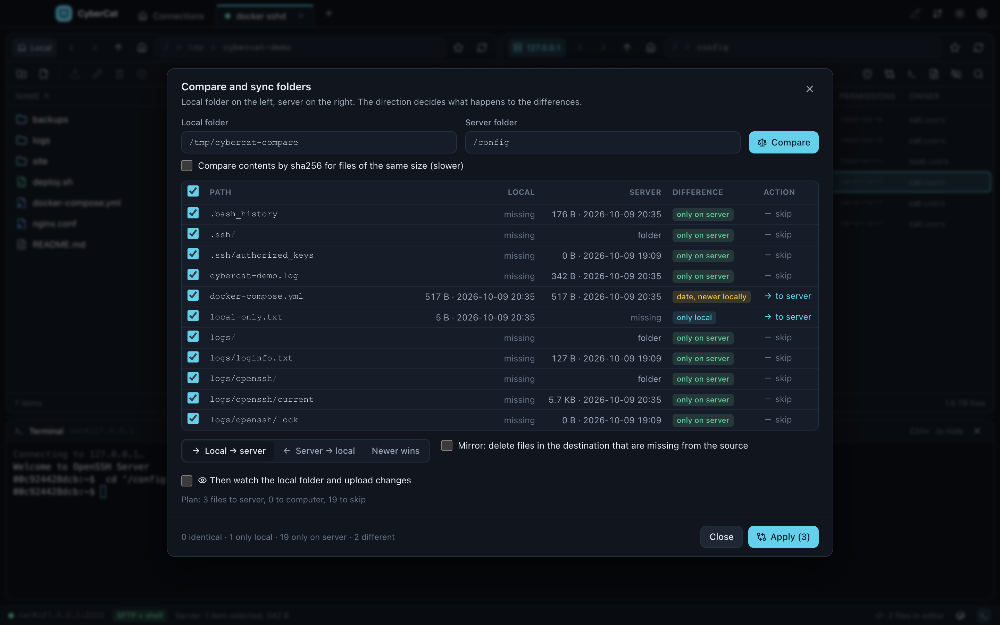

# CyberCat

[](https://github.com/EdFtem/CyberCat/actions/workflows/ci.yml)
[](LICENSE)
[](https://www.electronjs.org/)

Graphical SSH/SFTP file manager: dual-pane browser, resumable transfer queue, Monaco editor with encoding and EOL preservation, external editor auto-upload and a built-in terminal on the same SSH session. Built with Electron, React, TypeScript, Tailwind, ssh2, Monaco and xterm.js.



CyberCat is a WinSCP-style client for people who live in SSH all day. Connection profiles support passwords, OpenSSH and PuTTY keys and SSH agents, with passwords stored through the OS keychain and strict host key verification. Transfers run in a queue with pause, cancel, retry and resume from the last committed byte, and they survive reconnects. Files open in Monaco with the original encoding and line endings preserved, saves are atomic and conflicts with server-side edits are detected. Hosts import from `~/.ssh/config` including ProxyJump chains, logs can be followed live with `tail -F`, and files are searchable by name and content. A sudo mode runs `sftp-server` as root over a second channel, and folders can be compared and synchronized by size, mtime or sha256, with an optional watch mode that uploads local changes as they happen. A Docker view manages containers, images, volumes and compose projects over the same SSH session, streams `docker logs`, opens a shell inside a container and exposes published ports through SSH tunnels straight into your browser.

The interface is available in **English** and **Ukrainian**, see [Languages](#languages).

## Features

- **Connection profiles**: password, private key (OpenSSH, PuTTY `.ppk`, with passphrase), SSH agent (OpenSSH agent, Pageant). Passwords are stored encrypted through the OS keychain.
- **Host key verification**: the key is remembered on first connect, and a changed fingerprint triggers a hard warning.
- **Dual-pane browser** for local and remote files, with tabs for multiple servers, breadcrumbs, history, filter, sorting, permissions and owner, symbolic links and free disk space.
- **Transfers**: drag and drop between panes and from your file manager, a queue with pause, cancel, retry and resume of interrupted transfers, overwrite policies, mtime preservation and automatic continuation after a reconnect.
- **Built-in editor** based on Monaco: syntax highlighting, preserved encoding (UTF-8, UTF-8 BOM, Windows-1251) and line endings, atomic writes, conflict detection by modification time.
- **External editor**: the file is downloaded to a temporary folder, opened in your app of choice and uploaded automatically on every save.
- **File operations**: create folders and files, rename, move, recursive delete, recursive chmod, properties, copy path.
- **Built-in terminal** based on xterm.js in the same SSH session, opened in the current folder.
- **`~/.ssh/config` import**: hosts, users, ports, keys and ProxyJump in one click, with support for `Include` and patterns.
- **ProxyJump**: connect through one or more jump hosts, with bastion settings taken from your ssh config.
- **Live log view**: `tail -F` in a pty with level highlighting, filter, pause and auto-scroll; falls back to SFTP polling when there is no shell.
- **Server-side search**: by name with `find` and by content with `grep`, then jump to the file in the pane or open it in the editor.
- **sudo mode**: a separate SFTP channel through `sudo sftp-server` and commands run as root with a single toggle. The sudo password is verified upfront; the mode requires shell access.
- **Folder compare and sync**: by size, date or sha256, in the direction local → server, server → local or "newer wins", with an optional mirror that deletes extra files and a preview of the plan.
- **Local folder watch**: changes are uploaded to the server automatically, with an indicator in the title bar.
- **Move and clipboard**: F6 moves to the other pane and deletes the source; Ctrl+C, Ctrl+X and Ctrl+V work between panes and within one.
- **Batch rename**: find and replace with regular expressions, or a template with `{name}` `{ext}` `{n}` `{date}`, with a preview and conflict checks.
- **Custom commands**: your own commands with `%f` `%n` `%d` placeholders in the server context menu, with the output shown in a dialog.
- **Bookmarks** for local and remote folders.
- **Docker**: containers with live CPU and memory, health and ports; start, stop, restart, pause and remove; logs in the log viewer; a shell inside a container; a readable inspect view that jumps to bind mounts on the host; compose projects with up, down, restart, pull and opening the compose file; images and volumes with cleanup. Works through the docker or podman CLI over the same SSH session and suggests sudo mode when the Docker socket is not accessible.
- **Port tunnels**: click a container's published port to open it in your browser through an SSH tunnel; active tunnels are listed in the title bar.
- **Auto-reconnect** with keepalive and a persistent transfer queue.







## Languages

The interface is available in English and Ukrainian. On first launch CyberCat uses Ukrainian if it is your system's preferred language and English otherwise. You can switch at any time in **Settings** (Ctrl+,) → **Language**; the change applies immediately, without a restart, and is remembered.

Translations live in [`src/shared/i18n/locales`](src/shared/i18n/locales). To add a language, see [CONTRIBUTING.md](CONTRIBUTING.md#translations).

## Getting started

```bash
npm install
npm run dev        # development with hot reload
npm run build      # production build into out/
npm start          # run the built app
npm run dist       # package with electron-builder (Windows)
```

If you launch from a VS Code terminal and the window never appears, unset the `ELECTRON_RUN_AS_NODE` environment variable.

## Keyboard shortcuts

| Key | Action |
|---|---|
| Enter / Backspace | Open / go up |
| F2 | Rename |
| F3, F4 | Open in the editor |
| Shift+F4 | External editor |
| F5 | Copy to the other pane |
| F6 | Move to the other pane |
| Shift+F6 | Move to folder… |
| Ctrl+C, Ctrl+X, Ctrl+V | Copy, cut, paste |
| F7 | New folder |
| F8, Del | Delete |
| Ctrl+L | Edit path |
| Ctrl+F | Filter |
| Ctrl+Shift+F | Search in the current folder |
| Ctrl+H | Hidden files |
| Ctrl+R | Refresh |
| Ctrl+Shift+N | New file |
| Ctrl+Shift+C | Copy path |
| Ctrl+` | Terminal |
| Ctrl+Shift+D | Docker |
| Ctrl+E | Editor / files |
| Ctrl+Tab | Next tab |
| Ctrl+, | Settings |
| Tab | Other pane |

On macOS, Cmd works in place of Ctrl.

## Tests

The tests need a test SSH server in Docker:

```bash
docker run -d --name cybercat-sshd -p 2222:2222 -e PUID=1000 -e PGID=1000 \
  -e PASSWORD_ACCESS=true -e USER_NAME=cat -e USER_PASSWORD=catpass \
  lscr.io/linuxserver/openssh-server:latest

npm run test:e2e     # backend: SFTP, editor, transfers, shell
npm run test:ui      # UI screenshots into out/shots/
```

The ProxyJump and Docker scenarios need more setup on the test server: a second bastion container on port 2223 with `AllowTcpForwarding yes` in its sshd_config, plus `-v /var/run/docker.sock:/var/run/docker.sock` and `docker-cli` installed in the sshd container. The variables `CC_TEST_JUMP=cat@127.0.0.1:2223` and `CC_TEST_TARGET=<container ip>:2222` enable the ProxyJump checks; without them those sections are skipped.

The UI smoke test runs in English by default; set `CC_UI_LANG=uk` to run it in Ukrainian. The README screenshots in `docs/` come from this run, see [CONTRIBUTING.md](CONTRIBUTING.md#screenshots).

## Project layout

```
src/main        Electron main process: SSH sessions (ssh2), SFTP and local FS, transfers, editor, terminal, IPC
src/preload     window.api bridge (contextBridge)
src/renderer    React + Tailwind UI: panes, dialogs, Monaco editor, xterm terminal
src/shared      Shared types, the API contract and translations (i18n)
tests           Backend end-to-end test and UI smoke test
```

## Roadmap

- Installer and auto-update
- Server-to-server transfers
- Quick preview for images and PDF
- More interface languages (contributions welcome)

## Known limitations

- The built-in editor opens files up to 8 MB; open larger files in an external editor.
- Atomic saves create a new inode, so hard links to the file are broken.
- Server-to-server transfers are not supported yet.

## Contributing and license

Issues and pull requests are welcome, see [CONTRIBUTING.md](CONTRIBUTING.md). Please report vulnerabilities privately, see [SECURITY.md](SECURITY.md).

The code is released under the [MIT](LICENSE) license.
